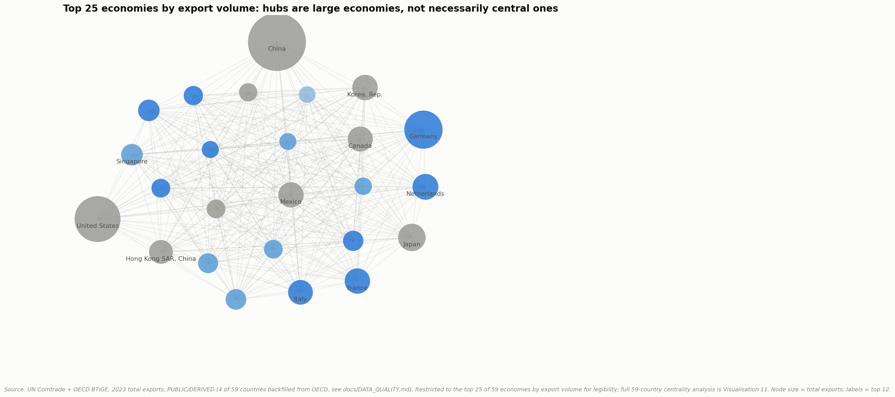

# Project 008: Global Supply Chain Intelligence

### Trade Networks, Logistics, Critical Resources, Supply Risk & Future Scenarios



**Part of a [8-case-study portfolio](https://github.com/ooi-darren)**, the second global-scope project, and the first to combine trade flows, critical-materials supply, network science, and forecasting into one system.

> Understanding how the world moves, identifying where supply chains are vulnerable, and assessing where they may go next, with a Malaysia 2030+ deep dive.

*This project was substantially revised twice after external review; see [`CHANGELOG.md`](CHANGELOG.md) for the full history. Findings below are stated as they currently stand.*

## Recommendation

**Malaysia should treat its current position as structurally sound but not defensible by default, and should treat the United States as a genuinely top-tier, not secondary, relationship on both sides of its trade: rising supplier-side concentration and a risk rank that swings from top-decile to comfortably mid-pack depending on which exposure matters most should be actively monitored, not assumed away, while its two strongest, evidence-backed levers, electronics/semiconductor assembly-test-packaging and its position astride the Strait of Malacca, the world's single largest oil-transit chokepoint, are the two areas where continued investment is best justified by this project's own data.** Everything below builds the evidence for this recommendation; the Key Strategic Insights section works through it finding by finding.

## Executive Summary

This project builds a global supply-chain intelligence system from UN Comtrade, OECD, USGS, World Bank, and Malaysia's DOSM data to test where global trade structure has actually shifted since 2016, where raw-material supply is genuinely concentrated, and what that means for Malaysia specifically, rather than relying on headline narratives. A genuinely complete 59-country bilateral trade network (three independent double-counting dimensions in the UN Comtrade free tier identified and corrected; UN Comtrade's free tier structurally excludes four of the 59 target countries entirely, United States, India, Belgium, and Ethiopia, resolved with a second, no-key public source, OECD's Bilateral Trade in Goods database, rather than left as a gap, see below) shows that network centrality and raw trade volume diverge sharply: India gained more structural importance than any other economy between 2016 and 2023 (+44% PageRank), with the Netherlands, Belgium, and Poland also rising fast, while the UK, Hong Kong SAR, and Japan lost the most (-17% to -24%), and Iran lost the most of all (-43%). A 13-material critical-minerals concentration index, built from real 2023 USGS production data, finds four materials, Gallium (China, 98%), Tungsten (China, 84%), Graphite (China, 79%), and Cobalt (DR Congo, 76%), far above the standard highly-concentrated HHI threshold of 2,500, with Nickel (Indonesia, 60%) the clearest live case of concentration still rising. A transparent, sensitivity-tested four-pillar Supply Chain Risk Index (Spearman ρ=0.986 against an alternative weighting) ranks all 59 economies; Malaysia sits mid-pack at 29th, with its own supplier concentration rising sharply (HHI 1,235 to 1,646, 2016-2023) once the United States is correctly included as a real trading partner for the first time, a finding that runs against the "China+1 diversification" narrative on the supplier side specifically. A Malaysia export forecast to 2030, validated on a genuine five-year rolling backtest rather than a single train/test split, finds that the simplest model with a trend, naive-with-drift, beats both ARIMA and ETS on real out-of-sample accuracy, reported honestly rather than replaced with a more impressive-looking result, forecasting RM1.87 trillion by 2030 (90% band: RM1.53-2.21 trillion). A companion 10,000-path Monte Carlo simulation on nickel prices, the one critical material with both a real production-concentration figure and a matching price history, puts the 12-month probability of a greater-than-20% price move at 25-27% (increase) versus 13-17% (decrease).

## Research Question

**How has the global supply-chain system changed over the past decade, what is happening now, where are the major dependencies and vulnerabilities, and what could happen over the next 5-10 years under different scenarios? And what do these changes mean for Malaysia specifically?**

## Key Findings

**1. Network importance and raw trade volume are not the same thing.** Between 2016 and 2023, India gained the most network importance of any economy (+44% PageRank), followed by Poland, the Netherlands, Belgium, Turkiye, and Bangladesh. The UK (-22%), Hong Kong SAR (-24%), and Japan (-18%) lost the most network importance over the same window, and Iran lost the most of all (-43%).

**2. Four materials are highly concentrated by any standard measure.** Gallium (China, 98% of world mine production, HHI=9,626), Tungsten (China, 84%, HHI=7,166), Graphite (China, 79%, HHI=6,314), and Cobalt (DR Congo, 76%, HHI=5,822) are all far above the standard "highly concentrated" HHI threshold of 2,500. Nickel (Indonesia, 60%, HHI=3,837) is a genuine, currently unfolding case of concentration rising fast on the back of Indonesia's export/downstreaming policy.

**3. Malaysia's supplier concentration rose sharply, 2016→2023; its customer concentration held roughly flat, a genuinely mixed picture, not a uniform trend.** Supplier HHI rose from 1,235 to 1,646 (still "unconcentrated," below 1,500 only in 2016; by 2023 it has crossed into the edge of "moderately concentrated" territory); customer HHI moved from 914 to 880, essentially flat, slightly down. The supplier-side result runs directly against a simple "diversification" narrative; the customer-side result does not support either a rising- or falling-concentration story strongly enough to claim one.

**4. China is Malaysia's single largest supplier (34.1% of imports, 2023) by a wide, directly-measured margin; on the customer side, the US is genuinely competitive with Malaysia's #1 customer, Singapore, but this project cannot responsibly claim the exact order.** Singapore is directly reported at 15.8%, China directly reported at 13.9%; the US figure (15.6%) is resolved from a mirror statistic (the US's own import report, since Malaysia's own export report to the US does not exist in UN Comtrade's free tier), and this project measured that kind of edge's typical uncertainty at the US-Malaysia trade relationship's size (~14-17%, see `docs/LIMITATIONS.md` item 17), a band wide enough to put the true figure anywhere from roughly $39-55 billion, spanning both Singapore's and China's directly-reported values. The honest finding is that the US is Malaysia's #1-or-#2 customer, not a settled #2 at 15.6% exactly.

**5. A validated backtest, not a dramatic model, wins the Malaysia export forecast.** Four models were compared on a genuine 5-year rolling backtest; the simple naive-with-drift baseline beat both ARIMA and ETS on out-of-sample RMSE, reported honestly per this project's own research-integrity standard rather than hidden. Forward forecast: RM 1.87 trillion by 2030 (90% band: RM 1.53-2.21 trillion).

**6. Malaysia ranks 29th of 59 economies on this project's Supply Chain Risk Index**, mid-pack, not a standout on either end, but that position is not as stable as a single ranking suggests. A 1,000-draw weight-sensitivity Monte Carlo shows Malaysia's rank actually ranges from 6th to 41st of 56 comparable countries depending on which of the four risk pillars is weighted most heavily, a genuinely wide band. The highest-risk economies (Cuba, Iran, Mongolia, Russia, Hong Kong SAR) share small/concentrated/geopolitically-exposed profiles; the lowest-risk (Germany, United States, Japan, France, China) are large, diversified, logistically strong economies. The network genuinely covers all 59 target countries (`docs/DATA_QUALITY.md` item 3 and `CHANGELOG.md` cover how that was verified), which is also why Mexico now appears as a top-10 highest-risk economy: its real, well-known trade concentration toward the US was invisible in this index until the US itself was a country in it.

**7. Malaysia's imports are 86% production inputs, not final consumption** (capital + intermediate goods share of retained imports, DOSM BEC data, 2025), direct evidence that Malaysia is deeply embedded in upstream manufacturing supply chains, not primarily an import-for-consumption economy.

**8. A real Monte Carlo, not an invented one.** A 10,000-simulation, historical-bootstrap 12-month nickel price simulation gives a 25-27% probability of a >20% price increase and a 13-17% probability of a >20% decrease, with two independent bootstrap methods agreeing to within 0.6% of the median, probabilities derived from nickel's actual 798-month price history, not assumed.

## Explain It Simply

Imagine every country in the world as a person in a giant trading network, buying things from some people and selling things to others. This project asks: has that network of buying and selling changed a lot in the last ten years? What's happening in it right now? And if something goes wrong somewhere in it, who gets hurt?

Three things this project found that matter for everyone, not just economists:

- **A few countries make almost all of some critical materials.** Nearly all the world's gallium (used in chips) comes from China. Most cobalt (used in EV batteries) comes from one country, DR Congo. If either country had a problem, a lot of the world's electronics and EV supply chains would feel it fast; this project measured exactly how concentrated each material really is, not just repeated the headline.
- **Being "connected" to the trade network matters as much as being "big."** A country can trade a huge amount of stuff and still not be a particularly *important* node in the network; this project used the same kind of network math that powers things like Google's search ranking (PageRank) to measure this properly, and found some real surprises: India's importance in the network jumped over 44% in just seven years, the biggest rise of any country tracked.
- **Malaysia buys from and sells to a lot of different countries. China is clearly its biggest supplier, but on the customer side, the United States turns out to be genuinely competitive with Malaysia's long-assumed #1 customer, Singapore**, close enough that this project's own data cannot say for certain which one is actually larger (a real, measured limitation of the specific data source used for the US relationship, explained honestly rather than papered over with a precise-sounding number).

This project also makes a forecast about Malaysia's exports out to 2030, and honestly reports that the simplest possible forecasting method (just "keep growing at the recent average rate") beat two much fancier statistical models when tested properly, which is itself a useful, honest finding. (New to terms like "HHI," "PageRank," or "Monte Carlo"? See the Glossary near the bottom.)

## Why This Research Matters

Businesses and policymakers routinely make claims about supply-chain "resilience," "diversification," or "critical dependency" without the underlying network, concentration, or forecast evidence to back them up. This project builds that evidence base directly from real trade, materials, and logistics data, with every claim traced to its source and every limitation stated plainly, the same standard as every other case study in this portfolio.

## Global Research Coverage

- **59 major economies**, genuinely all 59 for the bilateral trade network (UN Comtrade's free tier structurally excludes four of them entirely, United States, India, Belgium, Ethiopia, both as reporter and partner; backfilled from OECD's Bilateral Trade in Goods database, also free, no API key; see `docs/DATA_QUALITY.md` and `docs/LIMITATIONS.md`)
- **2 network years** (2016, 2023) × 2 trade flows, **236 UN Comtrade API calls + 16 OECD API calls**, **11,826 bilateral trade rows** kept after identifying and correcting three independent double-counting dimensions in the raw UN Comtrade response (transport mode, re-export/transit country, customs regime), resolved into **6,255 clean directed export edges** covering all 59 countries with no duplication (see `docs/DATA_QUALITY.md` for the exact resolution rule)
- **13 critical materials**, each selected against 4 documented selection criteria, concentration (HHI/CR3/CR5) computed from real 2023 country-level production data (USGS Mineral Commodity Summaries 2025, 184 country-material rows)
- **17 World Bank indicators** (trade openness, logistics, GDP, demographics) across **2013-2025**, a 2,821-row country-year panel
- **14 priority commodities**, monthly nominal prices since the 1960s (11,066 rows), current through July 2026 (World Bank Commodity Markets "Pink Sheet")
- **5 Malaysia-specific DOSM datasets** (trade headline 2001-2025, 275-row SITC detail, BEC end-use production-input breakdown) plus dedicated bilateral pulls (reporter code 458)
- **6 independent public data sources** in total, none behind a paywall (one, the US Census API, would have required a free registered key; used the OECD's Bilateral Trade in Goods database instead, which needs neither); full citations and licence terms in `docs/SOURCES.md`
- **19 visualisations** (17 required + 2 added after external review: a risk-index weight-sensitivity chart and a forecast stress test), **8 narrative notebooks**, **11 methodology/limitations/sources documents**

## Research Framework

```
Data Acquisition (UN Comtrade, OECD, World Bank, USGS, Pink Sheet, DOSM)
        │
Data Engineering (triple-double-counting fixes, missing-reporter backfill, region mapping, master panel, critical-materials table)
        │
Network Analysis (directed export graph, betweenness/eigenvector/PageRank, 2016 vs 2023)
        │
Concentration Analysis (critical-materials HHI/CR3/CR5, trade-partner HHI)
        │
Supply Chain Risk Index (4-pillar transparent composite, sensitivity-tested)
        │
Forecasting & Simulation (5-year rolling backtest, Monte Carlo historical bootstrap)
        │
Malaysia Deep Dive (vulnerability index, evidence-graded opportunity radar)
        │
Strategic Translation (DATA → INSIGHT → BUSINESS IMPLICATION → STRATEGIC CONSIDERATION)
```

## Global Supply Chain: What Changed Since 2016, What's Happening Now

The full historical review (2016-2019 pre-COVID baseline, 2020-2022 COVID shock, 2022-2024 geopolitical/logistics shock period, 2025-2026 current environment) and the structural-change classification (temporary vs. cyclical vs. structural vs. strategic vs. technological vs. geopolitical vs. environmental) are in `notebooks/02_historical_changes.ipynb`. The headline evidence: median trade openness across tracked economies and the 2016→2023 network-importance shifts above are the two clearest, most directly measurable signals this project can support with real data, shown in Visualisation 12.

## Regional Analysis

Europe and East Asia dominate merchandise export volume among tracked economies (Visualisation 3); full regional profile methodology reuses this portfolio's Project 007 8-region framework for cross-project consistency.

## Country / Market Analysis

Country-level import dependency, logistics fragility, trade concentration, and the combined Supply Chain Risk Index are in `data/processed/supply_chain_risk_index.csv` (Visualisations 4, 5, 10); full methodology in `docs/METHODOLOGY.md`.

## Critical Raw Materials

13 materials tracked (selection criteria in `docs/SOURCES.md`), concentration computed via HHI/CR3/CR5 on real 2023 USGS production data. Four materials (Gallium, Tungsten, Graphite, Cobalt) are highly concentrated by the standard 2,500-HHI threshold; Nickel is the clearest live case of rapidly rising concentration (Visualisation 6).

## Trade Network Analysis

Genuinely complete 59-country bilateral network, betweenness/eigenvector centrality and PageRank computed via NetworkX, compared 2016 vs. 2023 (Visualisations 2, 11). Full network-importance gainers/losers table: `data/processed/trade_network_pagerank_change.csv`. UN Comtrade's free tier structurally excludes four of the 59 target countries entirely (United States, India, Belgium, Ethiopia); every edge touching any of the four is resolved from OECD's Bilateral Trade in Goods database instead, one clean source per edge, documented in full in `docs/DATA_QUALITY.md`. This changed the network's own headline finding: India, not the UAE, is the biggest network-importance gainer 2016-2023 once the network is actually complete.

## Logistics Intelligence

World Bank Logistics Performance Index (overall + 3 sub-components) and container port traffic, compared globally (Visualisations 8, 9) and specifically across ASEAN-6 for the Malaysia deep dive.

## Supply Chain Risk

Four-pillar transparent composite (import dependency, logistics fragility, trade-partner concentration, commodity-price exposure), equal-weighted, min-max normalised, covering all 59 network countries, with two documented sensitivity checks: a single-alternative-weighting comparison (Spearman ρ=0.986 against a concentration-double-weighted alternative) and a fuller 1,000-draw weight-sensitivity Monte Carlo showing each country's rank range across random pillar weightings (Visualisation 18). Independently cross-checked, qualitatively, against two published external indices (DHL Global Connectedness Report 2026, Agility Emerging Markets Logistics Index 2026): see `docs/EXTERNAL_VALIDATION.md`. Full methodology: `docs/METHODOLOGY.md`.

## Future Scenarios

Two distinct tools, kept clearly separate: 8 discrete shock simulations (Section 14-style: a route closes, a supplier exits, a tariff hits) each traced SHOCK→SUPPLY→PRICE→LOGISTICS→PRODUCTION→TRADE→INDUSTRY→COUNTRY→CONSUMER, and 8 Malaysia 2030+ macro-strategic scenarios, each assessed for global/ASEAN/Malaysia impact. Full write-up, including which assumptions are grounded in a real comparable event versus illustrative: `docs/SCENARIO_METHODOLOGY.md` (Visualisation 14).

## Forecasting

Malaysia annual exports, 2001-2025 actual, forecast to 2030. Four models compared on a genuine 5-year rolling backtest (not a single train/test split); naive-with-drift won, reported honestly rather than hidden. The baseline forecast is also stress-tested against three real, historically-anchored shock scenarios (global recession, trade-tension escalation, energy price shock), moving the 2030 figure from RM1.87T to as low as RM1.77-1.80T under a real shock, not just a qualitative "this could be disrupted" caveat (Visualisation 19). Full methodology: `docs/FORECASTING.md` (Visualisations 13, 19).

## Malaysia Deep Dive 🇲🇾

Malaysia is a dedicated strategic case study, not an appendix: full framework in `docs/MALAYSIA_FRAMEWORK.md`. Covers: import/export composition (DOSM), bilateral supplier/customer concentration (UN Comtrade), ASEAN-6 logistics comparison (World Bank LPI), critical-minerals position (USGS), a 5-dimension Vulnerability Index, and an evidence-graded Opportunity Radar (Visualisations 15, 16, 17).

**The Strait of Malacca**: the world's largest oil-transit chokepoint by volume (23.2 million barrels/day, 29% of global maritime oil flows, EIA, 1H2025), only 1.7 miles wide at its narrowest point, runs directly along Malaysia's own coastline. It is simultaneously the clearest real-world grounding for Malaysia's "regional logistics hub" opportunity (Malaysia's own container-port traffic grew from 20.9 to 30.7 million TEU, 2013-2024, World Bank) and its most concrete geography-specific risk, both captured explicitly in `docs/SCENARIO_METHODOLOGY.md` Scenario A/F rather than left as an abstraction.

## Malaysia 2030+ Opportunities & Risks

**Strongly evidenced opportunities:** electronics/semiconductor assembly-test-packaging (Malaysia's largest real export category, 50.3% of exports by SITC section, roughly RM808 billion in 2025, `malaysia_trade_sitc_annual.csv`) and regional logistics hub positioning (2nd-highest LPI in ASEAN-6, behind only Singapore, grounded in the Strait of Malacca above). Named, publicly reported companies behind the electronics figure: Infineon's RM30 billion Kulim silicon-carbide fab, Micron's Muar/Prai/Batu Kawan facilities, ASE Technology's fifth Penang plant (February 2025). **A real volatility signal, reported here rather than omitted:** Intel paused its own Penang wafer-fabrication and advanced-packaging project in early 2025 during a company-wide financial restructuring; as of the most recent reporting checked, the facility is 99% complete and set to commence operations later in 2026, a genuine reversal that shows even Malaysia's strongest-evidenced opportunity carries real execution risk, not that the risk was permanent. **Weakly evidenced / speculative:** critical-minerals processing (Malaysia's own production share is under 2.3% for every tracked material; any real opportunity would be processing imported feedstock, not a domestic resource advantage). **Not evidenced by this project:** data-centre/digital-infrastructure investment (no direct dataset collected, a named gap, not a claim either way). Full evidence grading: `data/processed/malaysia_opportunity_radar.csv`; company sourcing: `docs/SOURCES.md`.

## Key Strategic Insights

### Insight 1: Network importance and raw trade volume diverge, and this analysis only became trustworthy once it was actually complete

**DATA:** Between 2016 and 2023, India gained more structural network importance than any other economy in this dataset (+44% PageRank), followed by Poland, the Netherlands, Belgium, Turkiye, and Bangladesh; the UK, Hong Kong SAR, and Japan lost the most (-17% to -24%), Iran lost the most of all (-43%).

**INSIGHT:** Ranking countries purely by trade volume or GDP misses this shift entirely, a country's position within the network is a separate signal than raw export value. But the deeper insight is methodological: a network-centrality finding built on an incomplete network, even one missing "only" 4 of 59 countries, can be actively wrong, not just imprecise, especially when the missing countries are among the most globally connected (the United States, in this case).

**BUSINESS IMPLICATION:** A market-entry or supplier-diversification strategy built on this project's own earlier, incomplete finding would have chased the wrong signal (the UAE) and missed the real one (India, the Netherlands, Belgium). The same risk applies to any third-party network analysis built on a data source with an undisclosed coverage gap.

**STRATEGIC CONSIDERATION:** Businesses reassessing regional hubs should track network-centrality measures like PageRank alongside trade-volume rankings, but should also demand to know exactly which countries a given network analysis does and does not cover before trusting its "who's rising" conclusions, a lesson this project learned about its own work, not just a generic caveat.

### Insight 2: Malaysia's supplier concentration is rising sharply; its customer concentration is not, a real, mixed finding

**DATA:** Malaysia's supplier HHI rose from 1,235 to 1,646 between 2016 and 2023 (crossing from "unconcentrated" toward the edge of "moderately concentrated"); customer HHI moved only slightly, from 914 to 880, essentially flat. China is Malaysia's largest supplier (34.1% of imports); on the customer side, Singapore (15.8%, directly reported) and China (13.9%, directly reported) bracket a US figure (15.6%) that this project's own uncertainty analysis (`docs/LIMITATIONS.md` item 17) shows could plausibly be anywhere from about $39-55 billion, wide enough to make the US genuinely competitive for #1, not a settled #2.

**INSIGHT:** The "China+1 diversification" narrative does not show up on Malaysia's supplier side (concentration is rising, not falling), but the customer side genuinely does not support a strong directional claim either way, a real, mixed picture that a single "concentration is rising" headline would have overstated.

**BUSINESS IMPLICATION:** A business assuming Malaysia has been actively diversifying its trade base away from China would be right on the customer side (roughly flat concentration, three real alternatives) but wrong on the supplier side (concentration is genuinely rising); a single blended "diversification score" would obscure this real asymmetry.

**STRATEGIC CONSIDERATION:** Supply-chain risk assessments specific to Malaysia should track supplier and customer concentration as two separate trends, not one, and should specifically verify that a US-inclusive data source is being used, since this project's own experience shows that gap alone was enough to change a headline customer-ranking finding.

### Insight 3: A validated, boring forecast beat two more sophisticated ones

**DATA:** Four forecasting models for Malaysia's exports (naive, naive-with-drift, ETS, ARIMA) were compared on a genuine five-year rolling-origin backtest; naive-with-drift, the simplest model with a trend, produced the lowest out-of-sample RMSE, beating both ARIMA and ETS.

**INSIGHT:** Model sophistication did not translate into forecast accuracy on this series; the finding is reported as-is rather than replaced with a more impressive-looking model, per this project's own research-integrity standard.

**BUSINESS IMPLICATION:** A forecasting exercise that skips backtesting and defaults to the most sophisticated available model (ARIMA, in this case) would have produced a *worse* Malaysia export forecast than the simplest reasonable baseline.

**STRATEGIC CONSIDERATION:** Any forecasting process feeding into planning or capital-allocation decisions should include a real rolling-origin backtest before a model is trusted, regardless of how established or sophisticated that model is assumed to be. The baseline forecast is also stress-tested against three real, historically-anchored shock scenarios rather than kept in permanent isolation from the scenario layer, see the Forecasting section below and `docs/FORECASTING.md`.

### Insight 4: Four materials sit far above any reasonable concentration threshold

**DATA:** Gallium (China, 98% of world mine production), Tungsten (China, 84%), Graphite (China, 79%), and Cobalt (DR Congo, 76%) are all far above the standard HHI=2,500 "highly concentrated" threshold; Nickel (Indonesia, 60% and rising) is the clearest live case of concentration still building.

**INSIGHT:** This is not a diffuse, minor-supplier-risk-somewhere pattern; a handful of single-country dependencies sit behind materials central to semiconductors, EV batteries, and specialty steel, and the concentration is measurable and current, not historical.

**BUSINESS IMPLICATION:** A business with exposure to electronics, EV, or specialty-steel supply chains should treat gallium, tungsten, graphite, and cobalt as genuinely single-point-of-failure materials, not merely "somewhat concentrated" ones, until diversified supply is independently verified.

**STRATEGIC CONSIDERATION:** Procurement and supply-chain-risk functions tracking critical-materials exposure should monitor concentration directly (HHI/CR3, recomputed as new production data is released) rather than relying on a static list of "critical minerals," since concentration itself is shifting, as Nickel currently demonstrates.

## Methodology

Full write-up: [`docs/METHODOLOGY.md`](docs/METHODOLOGY.md). In brief: PPP-adjusted GDP for income comparisons, nominal USD for market-size totals, nominal (non-deflated) commodity prices to preserve real shock magnitude, Python-only (no R/Power BI/Docker, documented "simplest tool" reasoning), the same transparent equal-weighted composite-index discipline established in this portfolio's Project 007.

## Data Sources

World Bank, UN Comtrade, OECD, USGS Mineral Commodity Summaries 2025, World Bank Commodity Markets (Pink Sheet), DOSM; full citations and four genuine data-quality discoveries (not assumptions) in [`docs/SOURCES.md`](docs/SOURCES.md).

## Notebooks

| # | Question | Data Rigor |
|---|---|---|
| [01: Global Trade](./notebooks/01_global_trade.ipynb) | What does the global trade network actually look like, and who are the real hubs? | PUBLIC |
| [02: Historical Changes](./notebooks/02_historical_changes.ipynb) | What changed structurally in global supply chains since 2016? | PUBLIC |
| [03: Regional Analysis](./notebooks/03_regional_analysis.ipynb) | Which regions are gaining or losing trade importance? | PUBLIC |
| [04: Country Analysis](./notebooks/04_country_analysis.ipynb) | Who depends on whom, and how concentrated is that dependency? | PUBLIC + DERIVED |
| [05: Critical Materials](./notebooks/05_critical_materials.ipynb) | Which raw materials are genuinely supply-concentrated, and by how much? | PUBLIC + DERIVED |
| [06: Network Analysis](./notebooks/06_network_analysis.ipynb) | Which countries are structurally central, not just big traders? | PUBLIC + DERIVED |
| [07: Risk & Forecasting](./notebooks/07_risk_and_forecasting.ipynb) | Where is supply-chain risk concentrated, and what does a validated forecast say about Malaysia's exports? | PUBLIC + DERIVED |
| [08: Malaysia Deep Dive](./notebooks/08_malaysia_deep_dive.ipynb) | What does all of this mean specifically for Malaysia? | PUBLIC + DERIVED |

## Limitations

Full document: [`docs/LIMITATIONS.md`](docs/LIMITATIONS.md) (17 items). Headline items: four of 59 target countries (United States, India, Belgium, Ethiopia) were structurally absent from the free-tier bilateral trade data, resolved via a second source, OECD's Bilateral Trade in Goods database (verified directly, not assumed; see `docs/DATA_QUALITY.md`), though its mirror-statistic edges carry a measured ~14-17% uncertainty band for large trade relationships; the network covers 59 major economies, not the full ~200; AIS/shipping-route data was not used (commercial/restricted, substituted with container port traffic); Malaysia sub-national analysis was not built (no sufficiently granular free data found); the risk index's commodity-exposure pillar is deliberately the crudest of its four pillars, named as such; the risk index's external validation is qualitative, not a formal statistical benchmark; the forecast stress test uses documented simplifying pass-through assumptions, not a modelled economic transmission channel; only Nickel has a matching production-concentration figure and price series for Monte Carlo simulation; and the named companies in the Malaysia section are illustrative public examples, not a systematic dataset.

## Glossary

Plain-language definitions for the technical terms used in this project.

- **Supply chain:** The full chain of suppliers, factories, and shipping routes that turns raw materials into a finished product a business or consumer buys.
- **Trade dependency:** How much a country relies on other countries for a good, either as a source (import dependency) or a market (export dependency).
- **HHI (Herfindahl-Hirschman Index):** A standard measure of how concentrated a market is among a few players, the sum of each player's market-share-squared. Above 2,500 is conventionally considered "highly concentrated."
- **Critical minerals:** Raw materials (like lithium, cobalt, or rare earths) that are essential for modern technology (batteries, chips, magnets) and where supply is often concentrated in just a few countries.
- **Network centrality:** A family of measures (betweenness, eigenvector, PageRank) for how structurally important a node is in a network, not the same as how big or busy it is.
- **PageRank:** The same core algorithm Google originally used to rank web pages, applied here to rank countries by how much they're connected to *other well-connected* countries, not just by raw trade volume.
- **Resilience / Vulnerability:** How well (resilience) or poorly (vulnerability) a system can absorb a shock without breaking down.
- **Scenario:** A structured "what if" story about how the future could unfold, built from explicit assumptions, not a prediction.
- **Forecast:** An actual quantitative estimate of a future value, built from a validated model: different from a scenario, and always reported with its own uncertainty.
- **Monte Carlo simulation:** Running a model thousands of times with randomly varied inputs (drawn from real historical data, in this project) to see the full range of possible outcomes, not just one guess.
- **CAGR (Compound Annual Growth Rate):** The average yearly growth rate of something over several years, as if it grew at one smooth, steady pace.
- **PUBLIC / DERIVED / ESTIMATED:** How traceable a number in this project is. **PUBLIC** = taken directly from an official source. **DERIVED** = built by combining or calculating from official sources this project directly fetched. **ESTIMATED** = based on a secondary source that couldn't be independently verified. See [`docs/DATA_DICTIONARY.md`](docs/DATA_DICTIONARY.md).

## Reproducibility

```bash
pip install -r requirements.txt

# 1. Collect raw data
python python/data_collection/world_bank.py
python python/data_collection/comtrade_network.py    # ~5-10 min, rate-limited to ~1 req/sec
python python/data_collection/oecd_missing_reporters_trade.py    # USA/India/Belgium/Ethiopia backfill, no API key, ~16 calls

# 2. Clean and build processed datasets
python python/cleaning/build_master_panel.py
python python/cleaning/merge_bilateral_trade.py    # merges the above two into the genuinely-complete 59-country network
python python/cleaning/clean_critical_materials.py
python python/cleaning/clean_commodity_prices.py
python python/cleaning/clean_malaysia_trade.py

# 3. Run the analysis layer
python python/networks/trade_network.py
python python/analysis/risk_index.py
python python/analysis/malaysia_deep_dive.py
python python/analysis/malaysia_vulnerability_opportunity.py
python python/analysis/validate_mirror_statistics.py    # quantifies the OECD backfill's mirror-statistic uncertainty

# 4. Forecasting and simulation
python python/forecasting/forecast_malaysia_exports.py
python python/simulation/monte_carlo_nickel.py

# 4b. Stress-test the forecast against real shock magnitudes (added after external review)
python python/forecasting/scenario_stress_test.py

# 5. Generate all 19 visualisations (17 required + 2 added after external review)
python python/visualisation/make_charts.py

# 6. Walk through the narrative notebooks
jupyter notebook notebooks/
```

All raw and processed data is committed to this repository (every source's licence permits redistribution. See `docs/SOURCES.md`), so steps 2-6 can be run directly without re-fetching from any API.

## Project Structure

```
project-008-global-supply-chain-intelligence/
├── README.md
├── CHANGELOG.md
├── data/
│   ├── raw/            # World Bank, UN Comtrade, USGS, DOSM, Pink Sheet pulls, unmodified
│   ├── processed/       # Cleaned panels, indices, forecasts, network tables
│   └── external/         # Region mapping, country-code reference, boundaries
├── notebooks/            # 01-08, narrative walkthrough of the python/ pipeline
├── python/
│   ├── data_collection/  # World Bank + UN Comtrade + OECD missing-reporter backfill
│   ├── cleaning/          # Master panel, bilateral trade merge, critical materials, commodity prices, Malaysia trade
│   ├── analysis/           # Risk index, Malaysia deep dive & vulnerability/opportunity, mirror-statistic validation
│   ├── networks/            # Trade network centrality
│   ├── forecasting/          # Malaysia export forecast + backtest + scenario stress test
│   ├── simulation/            # Nickel Monte Carlo
│   └── visualisation/          # House chart style + all 19 chart builders
├── outputs/
│   ├── figures/            # 19 PNG visualisations (17 required + 2 added after external review)
│   └── tables/               # (chart-ready summary tables, where applicable)
├── docs/
│   ├── METHODOLOGY.md
│   ├── DATA_DICTIONARY.md
│   ├── DATA_COVERAGE.md
│   ├── DATA_QUALITY.md
│   ├── SOURCES.md
│   ├── SOURCE_HIERARCHY.md
│   ├── LIMITATIONS.md
│   ├── FORECASTING.md
│   ├── SCENARIO_METHODOLOGY.md
│   ├── MALAYSIA_FRAMEWORK.md
│   └── EXTERNAL_VALIDATION.md
├── requirements.txt
├── LICENSE
└── .gitignore
```

## Sources

Full citations: [`docs/SOURCES.md`](docs/SOURCES.md).

## Author

Darren Ooi, [LinkedIn](https://www.linkedin.com/in/darrenooizhixian)
